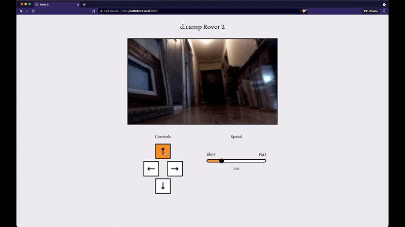

# Raspberry Pi Remote Controlled Rover

A remote controlled rover with live camera stream using Raspberry Pi + Pi camera module.

## How it works

The Pi streams the output of the camera module over the web via Flask. Devices connected to the same network would be able to access the camera stream via <hostname.local:500>, such as `http://battlebot1.local:5000`.

The rover can also be controlled through the UI/key input on the Flask server + GPIO pins.

## Demo



## What you need

- Raspberry Pi 4, 2GB is recommended for optimal performance. However you can use a Pi 3 or older, you may see a increase in latency.
- Raspberry Pi 4 Camera Module or Pi HQ Camera Module (Newer version)
- Python 3 recommended.
- [RC car kit](https://www.amazon.co.jp/gp/product/B088NMV7C6/ref=ppx_yo_dt_b_asin_title_o03_s00?ie=UTF8&psc=1)
- [DC motor drivers](https://www.amazon.co.jp/gp/product/B08B87WWHV/ref=ppx_yo_dt_b_asin_title_o04_s00?ie=UTF8&psc=1)
- A battery box + 8 AAA batteries (12V)

## Library dependencies

Install the following dependencies to create camera stream.

```
sudo apt-get update
sudo apt-get upgrade

sudo apt-get install libatlas-base-dev
sudo apt-get install libjasper-dev
sudo apt-get install libqtgui4
sudo apt-get install libqt4-test
sudo apt-get install libhdf5-dev

sudo pip3 install flask
sudo pip3 install numpy
sudo pip3 install opencv-contrib-python
sudo pip3 install imutils
sudo pip3 install opencv-python


```

pip3 install opencv-python

## Step 1 – Cloning Raspberry Pi Camera Stream

Open up terminal and clone the Camera Stream repo:

```
cd /home/pi
git clone https://github.com/diceky/pi-camera-stream-flask.git
```

## Step 2 – Launch Web Stream

Note: Creating an Autostart of the main.py script is recommended to keep the stream running on bootup.

```bash cd modules
sudo python3 /home/pi/pi-camera-stream-flask/main.py
```

## Step 3 – Hook up RC car kit + motor driver to Raspberry Pi and drive

Check the official pinout documentation [here](https://www.raspberrypi.org/documentation/computers/os.html#gpio-and-the-40-pin-header).
You can drive either buy clicking the UI or with keyboard arrow keys.

## Step 4 – Autostart your Pi Stream (Optional)

A good idea is to make the the camera stream auto start at bootup of your pi. You will now not need to re-run the script every time you want to create the stream. You can do this by going editing the /etc/profile to:

```
sudo nano /etc/profile
```

Go the end of the and add the following (from above):

```
sudo python3 /home/pi/pi-camera-stream-flask/main.py
```

This would cause the following terminal command to auto-start each time the Raspberry Pi boots up. This in effect creates a headless setup - which would be accessed via SSH.  
Note: make sure SSH is enabled.
